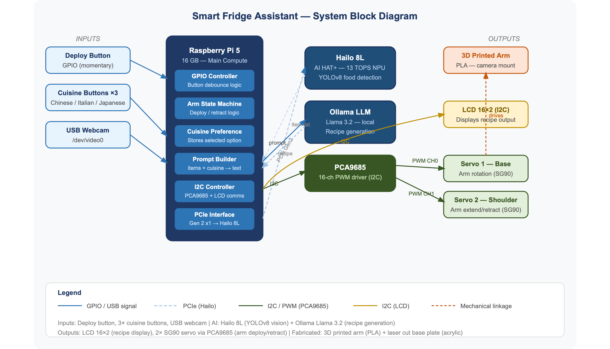

# fridge-assistant
**An on-device smart fridge assistant that detects food and suggests recipes — no cloud, no subscription.**

FridgeAssistant is a physical-computing system that identifies the ingredients in your fridge using a custom-trained computer-vision model, then generates a cuisine-specific recipe from them using a language model running **entirely locally** on a Raspberry Pi 5. A 3D-printed robotic arm swings a camera into the fridge to scan, then retracts.

Everything runs offline on ~$150 of hardware — compared to $3,000+ smart fridges that depend on the cloud and still don't generate recipes.

<!-- 👇 REPLACE with your demo GIF/video. A short clip of "press deploy → arm scans → recipe appears" is the single most valuable thing in this README. -->
<!--  -->

---

## What it does

1. Pick a cuisine (Chinese / Italian / Japanese) with a button
2. Press **Deploy** — a 3D-printed arm swings a camera down into the fridge
3. A **custom-trained YOLOv8 model** detects food items in the live camera feed
4. Press **Deploy** again to lock the detected ingredients
5. The ingredient list is sent to **Llama 3.2 (3B)**, running locally via **Ollama**, which returns a recipe — dish name, method, and any missing ingredients
6. The recipe shows on screen; pressing **Deploy** once more retracts the arm

The model is trained to recognize 10 real fridge ingredients: **cabbage, carrot, chicken, cucumber, egg, garlic, mushroom, onion, potato, zucchini.**

## Why I built it

People open the fridge without knowing what they have or what to cook — leading to food waste, duplicate grocery runs, and unnecessary takeout. Existing options don't solve it well: smart fridges cost thousands and rely on the cloud, and pantry apps need you to manually log every item (most people quit within a week). FridgeAssistant automates detection and runs fully offline, keeping everything private and cheap.

## Tech stack

**Software:** Python · YOLOv8 (Ultralytics) · ONNX Runtime · Ollama (Llama 3.2 3B) · OpenCV · Tkinter · gpiozero · Adafruit ServoKit
**Hardware:** Raspberry Pi 5 (16GB) · Hailo-8L AI HAT+ · USB webcam · PCA9685 PWM driver · 4× MG90S servos · HW-131 power module (2× 18650)
**Fabrication:** 3D-printed arm links & camera mount (Fusion 360) · laser-cut acrylic base plate

## System architecture



```
Cuisine button → Pi 5 stores preference
Deploy button  → arm deploys (PCA9685 → 4× MG90S servos)
               → webcam captures fridge interior
               → YOLOv8 (best.onnx) detects food items
               → ingredient list + cuisine → Ollama (Llama 3.2)
               → recipe returned → displayed on screen
Deploy again   → arm retracts to parked position
```

The software runs **three concurrent threads**: the Tkinter UI loop, a camera-capture thread (~30 fps), and a detection thread (~1 fps) that runs inference on the latest frame. A three-state state machine (`IDLE → DEPLOYED → RECIPE`) drives the whole flow from a single deploy button.

## Design evolution

This was built across six iterations, each solving a concrete problem:

- **v1–v2** — Integrated the Hailo GStreamer pipeline with the UI and servos, using the stock COCO YOLOv8 model. Problems: GStreamer's signal handlers only work in the main thread, and the COCO model detected generic objects (donut, banana) rather than real fridge ingredients.
- **v3–v4** — Replaced the GStreamer pipeline with Ultralytics YOLO running a **custom-trained `best.onnx`** model on the CPU. Traded NPU acceleration for reliability and clean threading; added the 10 custom food classes.
- **v5** — Added the three-state state machine and fixed detection accumulation so items found across multiple frames persist instead of being overwritten. Integrated Ollama via `subprocess` with prompt engineering for a 3-sentence recipe.
- **v6 (final)** — Full three-thread architecture, smooth servo interpolation with I²C retry logic, ANSI-code stripping on the LLM output, and calibrated deploy/retract sequencing to avoid mechanical collision.

## Engineering challenges solved

A few of the more interesting problems from the build (full log in [`hardware/`](hardware/)):

- **I²C bus speed:** the Pi 5's I²C controller runs at 97.5 kHz — too fast for the PCF8574T LCD backpack (`Errno 121`). After trying baud-rate configs and a software-I²C overlay, pivoted to an HDMI display.
- **Servo torque:** SG90 servos overheated and stalled trying to lift the arm — upgraded to metal-gear MG90S.
- **Bus instability:** four servos moving at once crashed the I²C bus until a proper common ground was established between the HW-131 power module and the Pi.
- **UI freezing:** detection was blocking the UI thread — split camera capture and inference into separate threads.
- **Camera init:** the Pi needs a ~2 s delay after opening the USB camera or `VideoCapture` fails.

## Hardware & wiring

<details>
<summary>Raspberry Pi 5 pin assignments</summary>

| GPIO (BCM) | Physical Pin | Connected To | Function |
|---|---|---|---|
| GPIO 2 (SDA) | 3 | PCA9685 SDA | I²C data |
| GPIO 3 (SCL) | 5 | PCA9685 SCL | I²C clock |
| GPIO 17 | 11 | Button OUT 1 | Deploy |
| GPIO 27 | 13 | Button OUT 2 | Chinese cuisine |
| GPIO 22 | 15 | Button OUT 3 | Italian cuisine |
| GPIO 23 | 16 | Button OUT 4 | Japanese cuisine |
| 3.3V | 1 | Button VCC | Button logic power |
| GND | 6 | Common ground bus | Shared ground |

Buttons are **active-HIGH** (`pull_up=False`).

</details>

<details>
<summary>PCA9685 servo driver & power</summary>

| PCA9685 | Connected To | Notes |
|---|---|---|
| VCC | HW-131 3.3V | Logic power (not Pi 3.3V — insufficient current) |
| V+ | HW-131 5V | Servo power rail (external supply) |
| GND | Common ground bus | **Must** share ground with Pi for I²C stability |
| SDA / SCL | GPIO 2 / GPIO 3 | I²C |
| CH1–CH4 | 4× MG90S (signal only) | Channel map in code: `CHANNELS = [4, 1, 2, 3]` (CH0 was faulty) |

Power: 2× 18650 (7.4 V) → HW-131 buck module → 5 V servo rail + 3.3 V logic.

</details>

Fabrication files are in [`hardware/`](hardware/): arm links (`.stl`) and the base plate (`.dxf`).

## Running it

> ⚠️ This is built for a **Raspberry Pi 5 with attached servo hardware** — it won't run end-to-end on a normal computer without the arm, PCA9685, and camera. The code and model are provided for reference and reproduction.

```bash
# On a Raspberry Pi 5 with the hardware attached:
pip install ultralytics opencv-python pillow gpiozero adafruit-circuitpython-servokit

# Install Ollama and pull the model
curl -fsSL https://ollama.com/install.sh | sh
ollama pull llama3.2:3b

# Update the model path in fridge_assistant.py to point to best.onnx, then:
python fridge_assistant.py
```

## Repository contents

| File | Description |
|---|---|
| `fridge_assistant.py` | Final integrated application (v6) |
| `best.onnx` | Custom-trained YOLOv8 model (10 food classes) |
| `media/block_diagram.png` | System architecture diagram |
| `hardware/` | 3D-print (`.stl`) and laser-cut (`.dxf`) fabrication files |

---

*Built as the capstone for Advanced Physical Computing (2025–2026). Combines a custom-trained vision model and a locally-run LLM on embedded hardware into a single working physical system.*

